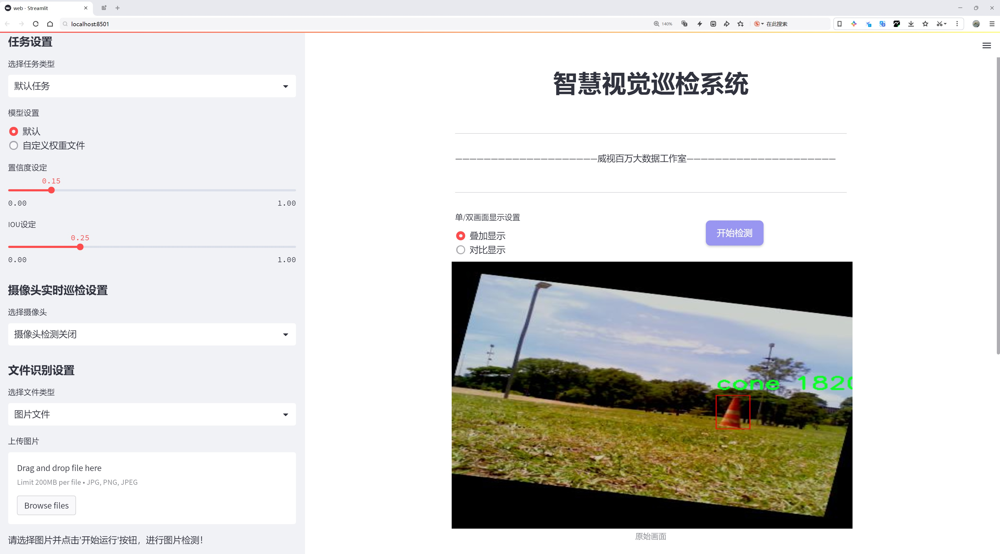
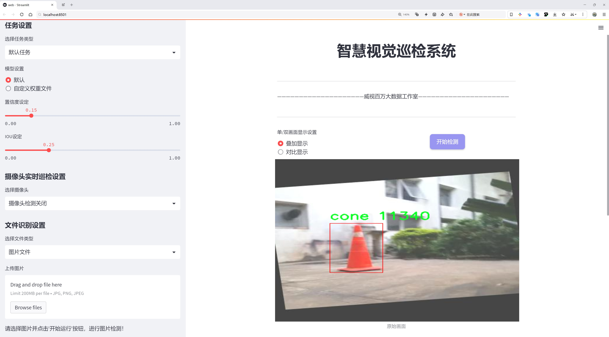
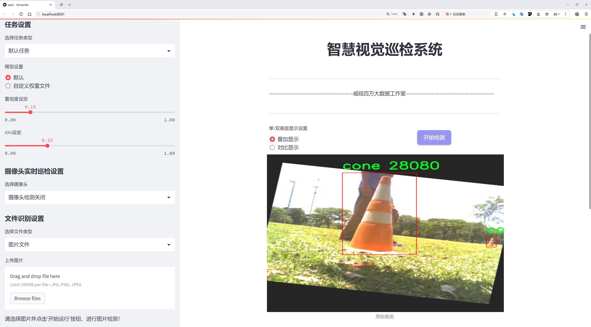
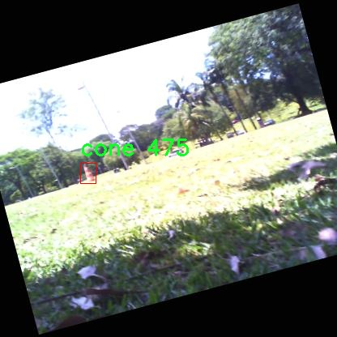
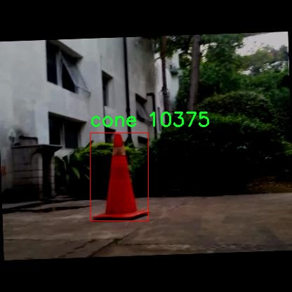
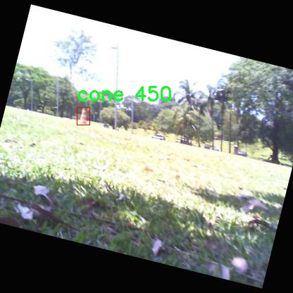
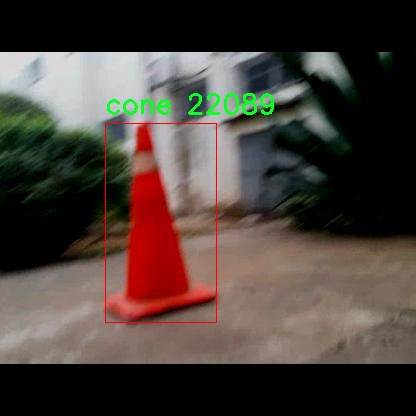
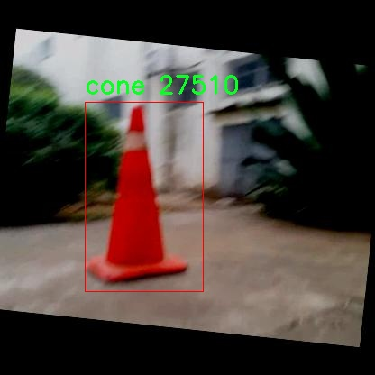

# 交通三角锥检测检测系统源码分享
 # [一条龙教学YOLOV8标注好的数据集一键训练_70+全套改进创新点发刊_Web前端展示]

### 1.研究背景与意义

项目参考[AAAI Association for the Advancement of Artificial Intelligence](https://gitee.com/qunshansj/projects)

项目来源[AACV Association for the Advancement of Computer Vision](https://gitee.com/qunmasj/projects)

研究背景与意义

随着城市化进程的加快，交通管理的复杂性日益增加，交通安全问题逐渐成为社会关注的焦点。交通三角锥作为重要的交通设施，广泛应用于道路施工、交通管制等场景，其作用在于引导车辆和行人安全通行，减少交通事故的发生。然而，传统的交通三角锥检测方法多依赖人工巡查，效率低下且容易受到人为因素的影响。因此，基于计算机视觉的自动检测系统应运而生，成为提升交通管理效率的重要手段。

近年来，深度学习技术的迅猛发展为目标检测领域带来了革命性的变化。YOLO（You Only Look Once）系列模型因其高效的实时检测能力而受到广泛关注。YOLOv8作为该系列的最新版本，结合了更为先进的网络结构和训练策略，展现出优异的检测性能。然而，针对特定场景下的目标检测，尤其是交通三角锥的检测，仍存在一定的挑战。交通三角锥的种类繁多，包括蓝色锥、橙色锥、黄色锥等，且在不同的光照、天气条件下，其外观特征可能会发生变化。因此，构建一个高效、准确的交通三角锥检测系统显得尤为重要。

本研究旨在基于改进的YOLOv8模型，开发一个高效的交通三角锥检测系统。为此，我们利用了一个包含14,000张图像的专用数据集，该数据集涵盖了六类交通三角锥，包括蓝色锥、橙色锥、黄色锥、未知锥以及大橙色锥等。这些数据不仅丰富了模型的训练样本，也为其在不同场景下的适应性提供了保障。通过对数据集的深入分析，我们可以更好地理解不同类型交通三角锥的特征，从而优化模型的训练过程，提高检测精度。

本研究的意义在于，通过改进YOLOv8模型，提升交通三角锥的自动检测能力，进而为智能交通系统的建设提供技术支持。该系统的实现将有效减少人工巡查的工作量，提高交通管理的效率和准确性。同时，准确的交通三角锥检测能够为交通参与者提供更为清晰的行驶指引，降低交通事故的发生率，保障道路安全。此外，该研究还将为后续的目标检测研究提供参考，推动交通管理领域的智能化发展。

综上所述，基于改进YOLOv8的交通三角锥检测系统不仅具有重要的理论价值，也具备广泛的应用前景。通过深入研究和探索，我们期望能够为智能交通管理提供切实可行的解决方案，为实现更安全、高效的交通环境贡献力量。

### 2.图片演示







##### 注意：由于此博客编辑较早，上面“2.图片演示”和“3.视频演示”展示的系统图片或者视频可能为老版本，新版本在老版本的基础上升级如下：（实际效果以升级的新版本为准）

  （1）适配了YOLOV8的“目标检测”模型和“实例分割”模型，通过加载相应的权重（.pt）文件即可自适应加载模型。

  （2）支持“图片识别”、“视频识别”、“摄像头实时识别”三种识别模式。

  （3）支持“图片识别”、“视频识别”、“摄像头实时识别”三种识别结果保存导出，解决手动导出（容易卡顿出现爆内存）存在的问题，识别完自动保存结果并导出到tempDir中。

  （4）支持Web前端系统中的标题、背景图等自定义修改，后面提供修改教程。

  另外本项目提供训练的数据集和训练教程,暂不提供权重文件（best.pt）,需要您按照教程进行训练后实现图片演示和Web前端界面演示的效果。

### 3.视频演示

[3.1 视频演示](https://www.bilibili.com/video/BV1cN4fefEGb/)

### 4.数据集信息展示

##### 4.1 本项目数据集详细数据（类别数＆类别名）

nc: 1
names: ['cone']


##### 4.2 本项目数据集信息介绍

数据集信息展示

在本研究中，我们采用了名为“Cones”的数据集，以支持对YOLOv8模型的改进，专注于交通三角锥的检测任务。该数据集专门设计用于提升计算机视觉系统在复杂交通环境中对交通标志物的识别能力，尤其是交通三角锥的精准检测。交通三角锥作为一种重要的交通管理工具，广泛应用于道路施工、交通引导和安全警示等场景，其准确识别对于确保交通安全和提高道路使用效率至关重要。

“Cones”数据集的构建过程经过精心设计，旨在提供高质量的训练样本，以便于模型学习和泛化。该数据集包含单一类别，即“cone”，这意味着所有的标注样本均为交通三角锥。这种专一性使得模型能够集中学习该类别的特征，从而提高检测的准确性和效率。数据集中包含的图像样本经过严格筛选，确保涵盖了多种场景和环境下的交通三角锥，诸如不同的光照条件、天气变化以及不同的拍摄角度。这种多样性为模型的训练提供了丰富的背景信息，增强了其在实际应用中的鲁棒性。

在数据集的标注过程中，采用了精确的边界框标注技术，以确保每个交通三角锥的位置信息准确无误。每个样本图像都配有相应的标注文件，详细记录了交通三角锥在图像中的位置和尺寸。这种标注方式不仅有助于YOLOv8模型的训练，也为后续的模型评估提供了可靠的基准。数据集的大小和样本数量经过精心考虑，以平衡训练时间和模型性能之间的关系，确保在有限的计算资源下实现最佳的检测效果。

为了进一步增强模型的泛化能力，数据集还包含了一些合成样本，这些样本通过图像增强技术生成，模拟了不同的环境条件和背景。这种方法有效地扩展了数据集的多样性，使得模型在面对未见过的场景时，仍能保持较高的检测准确率。此外，数据集的设计还考虑到了实际应用中的各种挑战，例如交通三角锥可能被其他物体遮挡、与背景的颜色相似等情况，这些都在数据集中得到了充分的体现。

总之，“Cones”数据集为改进YOLOv8的交通三角锥检测系统提供了坚实的基础。通过高质量的样本、精准的标注和丰富的场景变换，该数据集不仅为模型的训练提供了必要的数据支持，也为后续的性能评估和实际应用奠定了良好的基础。随着对该数据集的深入研究和应用，我们期待能够在交通安全和智能交通系统的构建中，发挥出更大的作用。











### 5.全套项目环境部署视频教程（零基础手把手教学）

[5.1 环境部署教程链接（零基础手把手教学）](https://www.ixigua.com/7404473917358506534?logTag=c807d0cbc21c0ef59de5)


[5.2 安装Python虚拟环境创建和依赖库安装视频教程链接（零基础手把手教学）](https://www.ixigua.com/7404474678003106304?logTag=1f1041108cd1f708b01a)

### 6.手把手YOLOV8训练视频教程（零基础小白有手就能学会）

[6.1 手把手YOLOV8训练视频教程（零基础小白有手就能学会）](https://www.ixigua.com/7404477157818401292?logTag=d31a2dfd1983c9668658)

### 7.70+种全套YOLOV8创新点代码加载调参视频教程（一键加载写好的改进模型的配置文件）

[7.1 70+种全套YOLOV8创新点代码加载调参视频教程（一键加载写好的改进模型的配置文件）](https://www.ixigua.com/7404478314661806627?logTag=29066f8288e3f4eea3a4)

### 8.70+种全套YOLOV8创新点原理讲解（非科班也可以轻松写刊发刊，V10版本正在科研待更新）

由于篇幅限制，每个创新点的具体原理讲解就不一一展开，具体见下列网址中的创新点对应子项目的技术原理博客网址【Blog】：


[8.1 70+种全套YOLOV8创新点原理讲解链接](https://gitee.com/qunmasj/good)

### 9.系统功能展示（检测对象为举例，实际内容以本项目数据集为准）

图9.1.系统支持检测结果表格显示

  图9.2.系统支持置信度和IOU阈值手动调节

  图9.3.系统支持自定义加载权重文件best.pt(需要你通过步骤5中训练获得)

  图9.4.系统支持摄像头实时识别

  图9.5.系统支持图片识别

  图9.6.系统支持视频识别

  图9.7.系统支持识别结果文件自动保存

  图9.8.系统支持Excel导出检测结果数据


### 10.原始YOLOV8算法原理

原始YOLOv8算法原理

YOLOv8（You Only Look Once version 8）作为目标检测领域的最新进展，承载着YOLO系列模型的演变与创新。自2015年首次提出以来，YOLO系列模型经历了多个版本的迭代，逐步优化了目标检测的速度和精度。YOLOv8在此基础上，通过引入新的网络结构和算法设计，进一步提升了模型的性能，成为了当前业界最受欢迎的目标检测算法之一。

YOLOv8的网络结构主要由三部分组成：Backbone、Neck和Head。Backbone负责特征提取，Neck用于特征融合，而Head则负责最终的目标检测输出。YOLOv8的Backbone采用了CSPDarknet结构，这是一种基于跨阶段部分网络（Cross Stage Partial Network）的设计理念。该结构通过将特征图分为多个分支，并在每个分支中引入多个残差块，有效地提升了特征提取的效率和准确性。与前代模型相比，YOLOv8引入了C2f模块，替代了C3模块，进一步增强了特征图的梯度流信息。C2f模块的设计使得输入特征图能够分为两个分支，经过卷积层降维后再进行融合，从而生成更高维度的特征图。这种设计不仅提升了模型的表达能力，还降低了计算复杂度。

在Neck部分，YOLOv8的设计同样进行了重要的改进。传统的Neck结构往往依赖于多次上采样和卷积操作，而YOLOv8则通过简化结构，直接对Backbone不同阶段输出的特征进行上采样。这种简化使得特征融合更加高效，同时减少了计算量，提升了整体的推理速度。Neck部分的设计灵活性和高效性，使得YOLOv8能够在多种应用场景中表现出色。

YOLOv8的Head部分是其最大的创新之一，采用了解耦头（Decoupled Head）结构。与之前的耦合头（Coupled Head）不同，YOLOv8的Head将目标检测和分类任务分开处理。具体而言，输入的特征图首先通过两个1x1的卷积模块进行降维，然后分别生成两个分支：一个用于类别预测，另一个用于边界框位置和交并比（IoU）的预测。这种解耦设计不仅提高了模型的准确性，还增强了模型的灵活性，使其能够更好地适应不同的目标检测任务。

YOLOv8还引入了无锚框（Anchor-Free）检测方法，彻底抛弃了传统的基于锚框的检测思路。在传统的锚框方法中，模型需要预先定义多个不同大小和长宽比的锚框，以覆盖可能出现的目标位置。这种方法虽然在一定程度上提高了检测精度，但也增加了计算复杂度，并且在处理不同尺度和形状的目标时显得不够灵活。YOLOv8通过将目标检测转化为关键点检测，避免了对锚框的依赖，使得模型在训练时无需预设锚框参数，从而提升了泛化能力和模型的简洁性。

在损失函数的设计上，YOLOv8也进行了优化。为了应对训练和推理过程中存在的逻辑不一致性，YOLOv8的Head结构中取消了对象分支，分类分支依然采用二值交叉熵损失（BCELoss），而边界框回归分支则使用了分布焦点损失（DFL）和CIoU损失。这种损失函数的设计使得模型能够更快地聚焦于标签附近的数值，提高了目标检测的精度。

YOLOv8在输入处理方面也进行了创新。默认情况下，YOLOv8的输入图像尺寸为640x640，但在实际应用中，图像的长宽比往往各不相同。为了解决这一问题，YOLOv8采用了自适应图像缩放技术，将长边按比例缩小到指定尺寸，然后对短边进行填充。这种处理方式有效减少了信息冗余，提高了目标检测和推理的速度。此外，YOLOv8在训练过程中引入了Mosaic图像增强操作，通过随机拼接多张图像，迫使模型学习不同位置和周围像素的特征，从而提升了模型的鲁棒性和预测精度。

总的来说，YOLOv8通过一系列创新的设计和优化，提升了目标检测的速度和准确性。其高效的特征提取、灵活的特征融合和解耦的检测策略，使得YOLOv8在各种目标检测任务中表现出色，成为了当前目标检测领域的一个重要里程碑。随着YOLOv8的广泛应用，未来的研究将可能围绕进一步优化模型结构、提升模型的适应性和扩展性展开，为目标检测技术的发展注入新的活力。


### 11.项目核心源码讲解（再也不用担心看不懂代码逻辑）

#### 11.1 ui.py

以下是对给定代码的核心部分进行保留和详细注释的版本：

```python
import sys
import subprocess

def run_script(script_path):
    """
    使用当前 Python 环境运行指定的脚本。

    Args:
        script_path (str): 要运行的脚本路径

    Returns:
        None
    """
    # 获取当前 Python 解释器的路径
    python_path = sys.executable

    # 构建运行命令，使用 streamlit 运行指定的脚本
    command = f'"{python_path}" -m streamlit run "{script_path}"'

    # 执行命令
    result = subprocess.run(command, shell=True)
    
    # 检查命令执行的返回码，如果不为0则表示出错
    if result.returncode != 0:
        print("脚本运行出错。")

# 实例化并运行应用
if __name__ == "__main__":
    # 指定要运行的脚本路径
    script_path = "web.py"  # 假设脚本在当前目录下

    # 调用函数运行脚本
    run_script(script_path)
```

### 代码分析与注释

1. **导入模块**：
   - `sys`：用于访问与 Python 解释器相关的变量和函数。
   - `subprocess`：用于创建新进程、连接到它们的输入/输出/错误管道，并获得它们的返回码。

2. **定义 `run_script` 函数**：
   - 此函数接受一个参数 `script_path`，表示要运行的 Python 脚本的路径。
   - 使用 `sys.executable` 获取当前 Python 解释器的路径，以确保脚本在正确的环境中运行。
   - 构建命令字符串，使用 `streamlit` 运行指定的脚本。
   - 使用 `subprocess.run` 执行构建的命令，并通过 `shell=True` 允许在 shell 中执行命令。
   - 检查命令的返回码，如果返回码不为0，表示脚本运行出错，打印错误信息。

3. **主程序块**：
   - 使用 `if __name__ == "__main__":` 确保只有在直接运行该脚本时才会执行以下代码。
   - 指定要运行的脚本路径为 `web.py`。
   - 调用 `run_script` 函数，传入脚本路径以运行该脚本。

这个简化的版本保留了代码的核心功能，并且通过注释解释了每个部分的作用。

这个文件是一个 Python 脚本，主要功能是运行一个名为 `web.py` 的脚本。首先，它导入了几个必要的模块，包括 `sys`、`os` 和 `subprocess`，这些模块提供了与系统交互的功能。特别是 `subprocess` 模块用于在新的进程中执行命令。

接下来，文件中定义了一个名为 `run_script` 的函数，该函数接受一个参数 `script_path`，表示要运行的脚本的路径。在函数内部，首先通过 `sys.executable` 获取当前 Python 解释器的路径，这样可以确保使用的是当前环境的 Python 版本。然后，构建一个命令字符串，该命令使用 `streamlit` 来运行指定的脚本。

使用 `subprocess.run` 方法执行构建好的命令，并通过 `shell=True` 参数在 shell 中运行它。执行后，函数会检查返回的结果码，如果不为零，表示脚本运行出错，程序会打印出错误信息。

在文件的最后部分，使用 `if __name__ == "__main__":` 来确保当脚本作为主程序运行时才会执行后面的代码。在这里，调用 `abs_path` 函数获取 `web.py` 的绝对路径，并将其传递给 `run_script` 函数，从而启动该脚本。

总的来说，这个脚本的作用是方便地在当前 Python 环境中运行一个 Streamlit 应用，具体的应用逻辑则在 `web.py` 文件中实现。

#### 11.2 70+种YOLOv8算法改进源码大全和调试加载训练教程（非必要）\ultralytics\utils\atss.py

以下是代码中最核心的部分，并附上详细的中文注释：

```python
import torch
import torch.nn as nn
import torch.nn.functional as F

def generate_anchors(feats, fpn_strides, grid_cell_size=5.0, grid_cell_offset=0.5, device='cpu', is_eval=False, mode='af'):
    '''根据特征生成锚框（anchors）。'''
    anchors = []  # 存储锚框
    anchor_points = []  # 存储锚点
    stride_tensor = []  # 存储每个锚框的步幅
    num_anchors_list = []  # 存储每个特征层的锚框数量

    assert feats is not None  # 确保特征不为空

    if is_eval:  # 如果是评估模式
        for i, stride in enumerate(fpn_strides):
            _, _, h, w = feats[i].shape  # 获取特征图的高度和宽度
            shift_x = torch.arange(end=w, device=device) + grid_cell_offset  # x方向的偏移
            shift_y = torch.arange(end=h, device=device) + grid_cell_offset  # y方向的偏移
            shift_y, shift_x = torch.meshgrid(shift_y, shift_x, indexing='ij')  # 创建网格
            anchor_point = torch.stack([shift_x, shift_y], axis=-1).to(torch.float)  # 生成锚点

            if mode == 'af':  # anchor-free模式
                anchor_points.append(anchor_point.reshape([-1, 2]))  # 将锚点展平并添加到列表
                stride_tensor.append(torch.full((h * w, 1), stride, dtype=torch.float, device=device))  # 记录步幅
            elif mode == 'ab':  # anchor-based模式
                anchor_points.append(anchor_point.reshape([-1, 2]).repeat(3, 1))  # 复制锚点
                stride_tensor.append(torch.full((h * w, 1), stride, dtype=torch.float, device=device).repeat(3, 1))  # 记录步幅

        anchor_points = torch.cat(anchor_points)  # 合并所有锚点
        stride_tensor = torch.cat(stride_tensor)  # 合并所有步幅
        return anchor_points, stride_tensor  # 返回锚点和步幅

    else:  # 训练模式
        for i, stride in enumerate(fpn_strides):
            _, _, h, w = feats[i].shape  # 获取特征图的高度和宽度
            cell_half_size = grid_cell_size * stride * 0.5  # 计算锚框的一半大小
            shift_x = (torch.arange(end=w, device=device) + grid_cell_offset) * stride  # x方向的偏移
            shift_y = (torch.arange(end=h, device=device) + grid_cell_offset) * stride  # y方向的偏移
            shift_y, shift_x = torch.meshgrid(shift_y, shift_x, indexing='ij')  # 创建网格

            # 生成锚框的坐标
            anchor = torch.stack(
                [
                    shift_x - cell_half_size, shift_y - cell_half_size,
                    shift_x + cell_half_size, shift_y + cell_half_size
                ],
                axis=-1).clone().to(feats[0].dtype)

            anchor_point = torch.stack([shift_x, shift_y], axis=-1).clone().to(feats[0].dtype)  # 生成锚点

            if mode == 'af':  # anchor-free模式
                anchors.append(anchor.reshape([-1, 4]))  # 将锚框展平并添加到列表
                anchor_points.append(anchor_point.reshape([-1, 2]))  # 将锚点展平并添加到列表
            elif mode == 'ab':  # anchor-based模式
                anchors.append(anchor.reshape([-1, 4]).repeat(3, 1))  # 复制锚框
                anchor_points.append(anchor_point.reshape([-1, 2]).repeat(3, 1))  # 复制锚点

            num_anchors_list.append(len(anchors[-1]))  # 记录当前锚框的数量
            stride_tensor.append(torch.full([num_anchors_list[-1], 1], stride, dtype=feats[0].dtype))  # 记录步幅

        anchors = torch.cat(anchors)  # 合并所有锚框
        anchor_points = torch.cat(anchor_points).to(device)  # 合并所有锚点并移动到指定设备
        stride_tensor = torch.cat(stride_tensor).to(device)  # 合并所有步幅并移动到指定设备
        return anchors, anchor_points, num_anchors_list, stride_tensor  # 返回锚框、锚点、锚框数量和步幅

class ATSSAssigner(nn.Module):
    '''自适应训练样本选择分配器'''
    def __init__(self, topk=9, num_classes=80):
        super(ATSSAssigner, self).__init__()
        self.topk = topk  # 每个样本选择的前k个候选框
        self.num_classes = num_classes  # 类别数量
        self.bg_idx = num_classes  # 背景类别索引

    @torch.no_grad()
    def forward(self, anc_bboxes, n_level_bboxes, gt_labels, gt_bboxes, mask_gt, pd_bboxes):
        '''前向传播函数，进行锚框分配'''
        self.n_anchors = anc_bboxes.size(0)  # 总锚框数量
        self.bs = gt_bboxes.size(0)  # 批次大小
        self.n_max_boxes = gt_bboxes.size(1)  # 每个批次最大框数

        if self.n_max_boxes == 0:  # 如果没有目标框
            device = gt_bboxes.device
            return torch.full([self.bs, self.n_anchors], self.bg_idx).to(device), \
                   torch.zeros([self.bs, self.n_anchors, 4]).to(device), \
                   torch.zeros([self.bs, self.n_anchors, self.num_classes]).to(device), \
                   torch.zeros([self.bs, self.n_anchors]).to(device)

        # 计算每个锚框与真实框的IoU
        overlaps = iou2d_calculator(gt_bboxes.reshape([-1, 4]), anc_bboxes)
        overlaps = overlaps.reshape([self.bs, -1, self.n_anchors])  # 重塑为(batch_size, n_max_boxes, n_anchors)

        # 计算每个真实框与锚框的中心距离
        distances, ac_points = dist_calculator(gt_bboxes.reshape([-1, 4]), anc_bboxes)
        distances = distances.reshape([self.bs, -1, self.n_anchors])  # 重塑为(batch_size, n_max_boxes, n_anchors)

        # 选择前k个候选框
        is_in_candidate, candidate_idxs = self.select_topk_candidates(distances, n_level_bboxes, mask_gt)

        # 计算每个候选框的IoU阈值
        overlaps_thr_per_gt, iou_candidates = self.thres_calculator(is_in_candidate, candidate_idxs, overlaps)

        # 选择IoU大于阈值的候选框作为正样本
        is_pos = torch.where(iou_candidates > overlaps_thr_per_gt.repeat([1, 1, self.n_anchors]),
                             is_in_candidate, torch.zeros_like(is_in_candidate))

        # 检查候选框是否在真实框内
        is_in_gts = select_candidates_in_gts(ac_points, gt_bboxes)
        mask_pos = is_pos * is_in_gts * mask_gt  # 计算正样本掩码

        # 选择与真实框重叠度最高的锚框
        target_gt_idx, fg_mask, mask_pos = select_highest_overlaps(mask_pos, overlaps, self.n_max_boxes)

        # 获取目标标签、框和分数
        target_labels, target_bboxes, target_scores = self.get_targets(gt_labels, gt_bboxes, target_gt_idx, fg_mask)

        # 如果有预测框，则进行软标签处理
        if pd_bboxes is not None:
            ious = iou_calculator(gt_bboxes, pd_bboxes) * mask_pos
            ious = ious.max(axis=-2)[0].unsqueeze(-1)  # 计算最大IoU
            target_scores *= ious  # 更新目标分数

        return target_labels, target_bboxes, target_scores, fg_mask.bool(), target_gt_idx  # 返回目标标签、框、分数、前景掩码和目标索引
```

以上代码是生成锚框和进行锚框分配的核心部分。注释详细解释了每个函数的功能和主要步骤，帮助理解代码的逻辑和实现。

这个程序文件主要实现了与YOLOv8算法相关的几个功能，特别是与目标检测中的锚框生成、重叠计算和自适应训练样本选择相关的功能。文件中使用了PyTorch库来进行张量操作和深度学习模型的构建。

首先，`generate_anchors`函数用于根据特征图生成锚框。它接收特征图、特征金字塔的步幅、网格单元大小和偏移量等参数。根据是否处于评估模式，函数会生成不同形式的锚框。在评估模式下，生成的是无锚框的点坐标；而在训练模式下，生成的是包含锚框坐标的张量。

接下来，`fp16_clamp`函数用于对浮点16位张量进行限制，以防止数值溢出。这在使用低精度计算时尤其重要。

`bbox_overlaps`函数用于计算两个边界框集合之间的重叠情况，支持多种重叠计算模式（如IoU、IoF和GIoU）。它可以处理批量输入，并根据是否对齐的标志进行不同的计算。该函数内部实现了重叠面积、并集面积的计算，并考虑了数值稳定性。

`cast_tensor_type`和`iou2d_calculator`函数用于处理张量类型转换和计算2D边界框的重叠情况，确保在内存使用和计算速度上达到优化。

`dist_calculator`函数计算所有边界框与真实框之间的中心距离，返回距离和锚框的中心点。

`iou_calculator`函数则计算批量边界框的IoU，适用于深度学习模型中的目标检测任务。

最后，`ATSSAssigner`类实现了自适应训练样本选择的功能。它的`forward`方法负责将锚框与真实框进行匹配，计算重叠度和距离，并根据一定的策略选择正负样本。该类还包括多个辅助方法，如选择候选框、计算阈值和获取目标等。

整体来看，这个文件为YOLOv8算法提供了重要的基础功能，特别是在目标检测任务中，如何生成锚框、计算重叠以及选择训练样本等方面。通过这些功能，可以有效地提高模型的训练效率和检测精度。

#### 11.3 70+种YOLOv8算法改进源码大全和调试加载训练教程（非必要）\ultralytics\models\sam\modules\sam.py

以下是经过简化和注释的核心代码部分：

```python
import torch
from torch import nn
from typing import List

class Sam(nn.Module):
    """
    Sam (Segment Anything Model) 是一个用于对象分割任务的模型。它通过图像编码器生成图像嵌入，并使用提示编码器对各种输入提示进行编码。这些嵌入随后被掩码解码器用于预测对象掩码。
    """

    def __init__(
        self,
        image_encoder: nn.Module,  # 图像编码器，用于将图像编码为嵌入
        prompt_encoder: nn.Module,  # 提示编码器，用于编码输入提示
        mask_decoder: nn.Module,  # 掩码解码器，用于从图像和提示嵌入中预测掩码
        pixel_mean: List[float] = (123.675, 116.28, 103.53),  # 图像归一化的均值
        pixel_std: List[float] = (58.395, 57.12, 57.375)  # 图像归一化的标准差
    ) -> None:
        """
        初始化 Sam 类以从图像和输入提示中预测对象掩码。

        参数:
            image_encoder (nn.Module): 用于编码图像的主干网络。
            prompt_encoder (nn.Module): 编码各种类型输入提示的模块。
            mask_decoder (nn.Module): 从图像嵌入和编码提示中预测掩码的模块。
            pixel_mean (List[float], optional): 输入图像的像素归一化均值，默认为 (123.675, 116.28, 103.53)。
            pixel_std (List[float], optional): 输入图像的像素归一化标准差，默认为 (58.395, 57.12, 57.375)。
        """
        super().__init__()  # 调用父类的初始化方法
        self.image_encoder = image_encoder  # 保存图像编码器
        self.prompt_encoder = prompt_encoder  # 保存提示编码器
        self.mask_decoder = mask_decoder  # 保存掩码解码器
        # 注册像素均值和标准差为缓冲区，以便在模型中使用
        self.register_buffer('pixel_mean', torch.Tensor(pixel_mean).view(-1, 1, 1), False)
        self.register_buffer('pixel_std', torch.Tensor(pixel_std).view(-1, 1, 1), False)
```

### 代码注释说明：
1. **类定义**：`Sam` 类继承自 `nn.Module`，是一个用于对象分割的模型。
2. **初始化方法**：`__init__` 方法用于初始化模型的各个组件，包括图像编码器、提示编码器和掩码解码器。
3. **参数说明**：
   - `image_encoder`：负责将输入图像转换为嵌入表示的模块。
   - `prompt_encoder`：负责将输入提示（如用户提供的区域或类别信息）编码为嵌入表示的模块。
   - `mask_decoder`：根据图像和提示的嵌入预测对象的掩码。
   - `pixel_mean` 和 `pixel_std`：用于图像预处理的均值和标准差，确保输入图像的像素值在训练时的分布一致。
4. **缓冲区注册**：使用 `register_buffer` 方法将均值和标准差注册为模型的缓冲区，这样它们不会被视为模型的参数，但在模型的前向传播中仍然可用。

这个程序文件是一个名为 `sam.py` 的 Python 文件，属于 Ultralytics YOLO 系列的一个模块，主要用于实现“Segment Anything Model”（SAM），这是一个用于对象分割任务的模型。文件中包含了类 `Sam` 的定义，该类继承自 PyTorch 的 `nn.Module`，并实现了图像编码、提示编码和掩码解码的功能。

在类的文档字符串中，详细描述了 SAM 模型的设计目的和功能。它通过图像编码器生成图像嵌入，并使用提示编码器对不同类型的输入提示进行编码。这些嵌入随后被掩码解码器用于预测对象的掩码。

类中定义了几个属性，包括 `mask_threshold`（掩码预测的阈值）、`image_format`（输入图像的格式，默认为 RGB）、`image_encoder`（用于将图像编码为嵌入的主干网络）、`prompt_encoder`（用于编码各种输入提示的编码器）、`mask_decoder`（从图像和提示嵌入中预测对象掩码的解码器）、`pixel_mean` 和 `pixel_std`（用于图像归一化的均值和标准差）。

在 `__init__` 方法中，初始化了 SAM 类的实例。构造函数接受三个主要参数：`image_encoder`、`prompt_encoder` 和 `mask_decoder`，分别用于图像编码、提示编码和掩码预测。此外，还可以传入用于图像归一化的均值和标准差，默认值分别为 (123.675, 116.28, 103.53) 和 (58.395, 57.12, 57.375)。

在初始化过程中，调用了父类的构造函数，并将传入的编码器和解码器赋值给相应的属性。同时，使用 `register_buffer` 方法注册了图像归一化所需的均值和标准差，这样它们将作为模型的一部分进行管理，但不会被视为模型的可学习参数。

总的来说，这个文件的核心功能是定义一个用于对象分割的模型结构，整合了图像编码、提示处理和掩码预测的功能，为后续的模型训练和推理提供了基础。

#### 11.4 train.py

以下是经过简化和注释的核心代码部分：

```python
import random
import numpy as np
import torch.nn as nn
from ultralytics.data import build_dataloader, build_yolo_dataset
from ultralytics.engine.trainer import BaseTrainer
from ultralytics.models import yolo
from ultralytics.nn.tasks import DetectionModel
from ultralytics.utils import LOGGER, RANK
from ultralytics.utils.torch_utils import de_parallel, torch_distributed_zero_first

class DetectionTrainer(BaseTrainer):
    """
    扩展自 BaseTrainer 类，用于基于检测模型的训练。
    """

    def build_dataset(self, img_path, mode="train", batch=None):
        """
        构建 YOLO 数据集。

        参数:
            img_path (str): 包含图像的文件夹路径。
            mode (str): 模式，可以是 `train` 或 `val`，用户可以为每种模式自定义不同的增强。
            batch (int, optional): 批次大小，仅用于 `rect` 模式。默认为 None。
        """
        gs = max(int(de_parallel(self.model).stride.max() if self.model else 0), 32)  # 获取模型的最大步幅
        return build_yolo_dataset(self.args, img_path, batch, self.data, mode=mode, rect=mode == "val", stride=gs)

    def get_dataloader(self, dataset_path, batch_size=16, rank=0, mode="train"):
        """构造并返回数据加载器。"""
        assert mode in ["train", "val"]  # 确保模式有效
        with torch_distributed_zero_first(rank):  # 仅在 DDP 中初始化数据集 *.cache 一次
            dataset = self.build_dataset(dataset_path, mode, batch_size)  # 构建数据集
        shuffle = mode == "train"  # 训练模式下打乱数据
        workers = self.args.workers if mode == "train" else self.args.workers * 2  # 设置工作线程数
        return build_dataloader(dataset, batch_size, workers, shuffle, rank)  # 返回数据加载器

    def preprocess_batch(self, batch):
        """对一批图像进行预处理，包括缩放和转换为浮点数。"""
        batch["img"] = batch["img"].to(self.device, non_blocking=True).float() / 255  # 转换为浮点数并归一化
        if self.args.multi_scale:  # 如果启用多尺度
            imgs = batch["img"]
            sz = (
                random.randrange(self.args.imgsz * 0.5, self.args.imgsz * 1.5 + self.stride)
                // self.stride
                * self.stride
            )  # 随机选择新的尺寸
            sf = sz / max(imgs.shape[2:])  # 计算缩放因子
            if sf != 1:
                ns = [
                    math.ceil(x * sf / self.stride) * self.stride for x in imgs.shape[2:]
                ]  # 计算新的形状
                imgs = nn.functional.interpolate(imgs, size=ns, mode="bilinear", align_corners=False)  # 进行插值
            batch["img"] = imgs  # 更新图像
        return batch

    def set_model_attributes(self):
        """设置模型的属性，包括类别数量和名称。"""
        self.model.nc = self.data["nc"]  # 将类别数量附加到模型
        self.model.names = self.data["names"]  # 将类别名称附加到模型
        self.model.args = self.args  # 将超参数附加到模型

    def get_model(self, cfg=None, weights=None, verbose=True):
        """返回 YOLO 检测模型。"""
        model = DetectionModel(cfg, nc=self.data["nc"], verbose=verbose and RANK == -1)  # 创建检测模型
        if weights:
            model.load(weights)  # 加载权重
        return model

    def plot_training_samples(self, batch, ni):
        """绘制带有注释的训练样本。"""
        plot_images(
            images=batch["img"],
            batch_idx=batch["batch_idx"],
            cls=batch["cls"].squeeze(-1),
            bboxes=batch["bboxes"],
            paths=batch["im_file"],
            fname=self.save_dir / f"train_batch{ni}.jpg",
            on_plot=self.on_plot,
        )
```

### 代码说明：
1. **导入模块**：导入必要的库和模块，包括数据处理、模型构建和训练工具。
2. **DetectionTrainer 类**：继承自 `BaseTrainer`，用于处理目标检测任务的训练。
3. **build_dataset 方法**：根据给定的图像路径和模式构建 YOLO 数据集，支持训练和验证模式。
4. **get_dataloader 方法**：构建数据加载器，确保在分布式训练中只初始化一次数据集。
5. **preprocess_batch 方法**：对输入的图像批次进行预处理，包括归一化和可选的多尺度调整。
6. **set_model_attributes 方法**：设置模型的类别数量和名称等属性。
7. **get_model 方法**：创建并返回一个 YOLO 检测模型，支持加载预训练权重。
8. **plot_training_samples 方法**：绘制训练样本及其注释，便于可视化训练过程。

这个程序文件 `train.py` 是一个用于训练 YOLO（You Only Look Once）目标检测模型的实现，继承自 `BaseTrainer` 类。程序中包含了多个方法，用于构建数据集、获取数据加载器、预处理图像批次、设置模型属性、获取模型、验证模型、记录损失、输出训练进度、绘制训练样本和绘制训练指标等。

首先，`DetectionTrainer` 类的构造函数通过 `build_dataset` 方法构建 YOLO 数据集。该方法接受图像路径、模式（训练或验证）和批次大小作为参数，使用 `build_yolo_dataset` 函数来创建数据集。数据集的构建会根据模型的步幅（stride）进行调整，以确保图像的尺寸符合要求。

接下来，`get_dataloader` 方法用于构建和返回数据加载器。它会根据传入的模式（训练或验证）来决定是否打乱数据顺序，并设置工作线程的数量。该方法还确保在分布式训练中，数据集的初始化只执行一次，以提高效率。

在图像预处理方面，`preprocess_batch` 方法负责将图像批次缩放并转换为浮点数格式。它会根据设置的多尺度训练参数随机调整图像的大小，并使用双线性插值法调整图像尺寸，以确保图像的形状符合模型的要求。

`set_model_attributes` 方法用于设置模型的属性，包括类别数量和类别名称等。这些属性是根据数据集的信息进行配置的，以确保模型能够正确识别不同的目标。

`get_model` 方法返回一个 YOLO 检测模型的实例，可以选择加载预训练的权重。`get_validator` 方法则返回一个用于验证模型性能的 `DetectionValidator` 实例。

在训练过程中，`label_loss_items` 方法用于返回带有标签的训练损失项字典，方便记录和分析训练过程中的损失情况。`progress_string` 方法则格式化输出训练进度，包括当前的轮次、GPU 内存使用情况、损失值、实例数量和图像大小等信息。

此外，`plot_training_samples` 方法用于绘制训练样本及其标注，便于可视化训练数据的质量。最后，`plot_metrics` 和 `plot_training_labels` 方法用于绘制训练过程中的指标和标签，帮助分析模型的训练效果。

整体而言，这个程序文件提供了一个完整的框架，用于训练 YOLO 模型，包括数据处理、模型构建、训练过程监控和结果可视化等功能。

#### 11.5 70+种YOLOv8算法改进源码大全和调试加载训练教程（非必要）\ultralytics\models\rtdetr\model.py

```python
# Ultralytics YOLO 🚀, AGPL-3.0 license
"""
RT-DETR接口，基于视觉变换器的实时目标检测器。RT-DETR提供实时性能和高准确性，
在CUDA和TensorRT等加速后端表现出色。它具有高效的混合编码器和IoU感知查询选择，
以提高检测准确性。

有关RT-DETR的更多信息，请访问：https://arxiv.org/pdf/2304.08069.pdf
"""

from ultralytics.engine.model import Model  # 导入基础模型类
from ultralytics.nn.tasks import RTDETRDetectionModel  # 导入RT-DETR检测模型

from .predict import RTDETRPredictor  # 导入预测器
from .train import RTDETRTrainer  # 导入训练器
from .val import RTDETRValidator  # 导入验证器


class RTDETR(Model):
    """
    RT-DETR模型接口。该基于视觉变换器的目标检测器提供实时性能和高准确性。
    它支持高效的混合编码、IoU感知查询选择和可调的推理速度。

    属性:
        model (str): 预训练模型的路径。默认为'rtdetr-l.pt'。
    """

    def __init__(self, model='rtdetr-l.pt') -> None:
        """
        使用给定的预训练模型文件初始化RT-DETR模型。支持.pt和.yaml格式。

        参数:
            model (str): 预训练模型的路径。默认为'rtdetr-l.pt'。

        异常:
            NotImplementedError: 如果模型文件扩展名不是'pt'、'yaml'或'yml'。
        """
        # 检查模型文件的扩展名是否有效
        if model and model.split('.')[-1] not in ('pt', 'yaml', 'yml'):
            raise NotImplementedError('RT-DETR仅支持从*.pt、*.yaml或*.yml文件创建。')
        # 调用父类的初始化方法
        super().__init__(model=model, task='detect')

    @property
    def task_map(self) -> dict:
        """
        返回RT-DETR的任务映射，将任务与相应的Ultralytics类关联。

        返回:
            dict: 一个字典，将任务名称映射到RT-DETR模型的Ultralytics任务类。
        """
        return {
            'detect': {
                'predictor': RTDETRPredictor,  # 预测器类
                'validator': RTDETRValidator,  # 验证器类
                'trainer': RTDETRTrainer,  # 训练器类
                'model': RTDETRDetectionModel  # RT-DETR检测模型类
            }
        }
```

### 代码核心部分及注释说明：
1. **类定义**：`RTDETR`类继承自`Model`，是RT-DETR模型的接口，提供实时目标检测功能。
2. **初始化方法**：`__init__`方法用于初始化模型，检查模型文件的格式是否合法，并调用父类的初始化方法。
3. **任务映射**：`task_map`属性返回一个字典，映射了不同的任务（如预测、验证、训练）到相应的Ultralytics类，便于后续调用。

该程序文件是关于百度的RT-DETR模型的接口实现，RT-DETR是一种基于视觉变换器（Vision Transformer）的实时目标检测器，具有高效的实时性能和准确性，特别是在CUDA和TensorRT等加速后端上表现优异。文件中包含了RT-DETR的基本信息、模型初始化、任务映射等功能。

在文件开头，首先引入了必要的模块，包括Ultralytics库中的Model类和RTDETRDetectionModel类，以及预测、训练和验证的相关模块。接着定义了RTDETR类，该类继承自Model类，作为RT-DETR模型的接口。

RTDETR类的构造函数`__init__`接受一个参数`model`，用于指定预训练模型的路径，默认值为'rtdetr-l.pt'。在初始化过程中，程序会检查模型文件的扩展名，确保其为支持的格式（.pt、.yaml或.yml），如果不符合要求，则抛出NotImplementedError异常。

此外，RTDETR类还定义了一个属性`task_map`，该属性返回一个字典，映射了与RT-DETR模型相关的任务及其对应的Ultralytics类。具体来说，它将目标检测任务（'detect'）与相应的预测器（RTDETRPredictor）、验证器（RTDETRValidator）、训练器（RTDETRTrainer）和模型（RTDETRDetectionModel）关联起来。

总的来说，该文件为RT-DETR模型提供了一个清晰的接口，方便用户进行目标检测任务的预测、训练和验证。通过这个接口，用户可以利用RT-DETR的高效性能和准确性来处理各种目标检测应用。

#### 11.6 code\ultralytics\models\fastsam\model.py

以下是代码中最核心的部分，并附上详细的中文注释：

```python
from pathlib import Path
from ultralytics.engine.model import Model
from .predict import FastSAMPredictor
from .val import FastSAMValidator

class FastSAM(Model):
    """
    FastSAM模型接口。

    示例用法：
        ```python
        from ultralytics import FastSAM

        model = FastSAM('last.pt')  # 加载模型
        results = model.predict('ultralytics/assets/bus.jpg')  # 进行预测
        ```
    """

    def __init__(self, model="FastSAM-x.pt"):
        """初始化FastSAM类，调用父类（YOLO）的__init__方法，并设置默认模型。"""
        # 如果传入的模型名称是"FastSAM.pt"，则使用"FastSAM-x.pt"作为默认模型
        if str(model) == "FastSAM.pt":
            model = "FastSAM-x.pt"
        # 确保传入的模型文件不是yaml格式，因为FastSAM只支持预训练模型
        assert Path(model).suffix not in (".yaml", ".yml"), "FastSAM模型仅支持预训练模型。"
        # 调用父类的初始化方法，设置模型和任务类型为"segment"
        super().__init__(model=model, task="segment")

    @property
    def task_map(self):
        """返回一个字典，将分割任务映射到相应的预测器和验证器类。"""
        return {
            "segment": {
                "predictor": FastSAMPredictor,  # 预测器类
                "validator": FastSAMValidator     # 验证器类
            }
        }
```

### 代码核心部分解释：
1. **导入必要的模块**：导入了路径处理模块`Path`和YOLO模型的基类`Model`，以及FastSAM的预测和验证类。
  
2. **FastSAM类**：这是一个继承自`Model`的类，主要用于封装FastSAM模型的功能。

3. **初始化方法`__init__`**：
   - 允许用户指定模型文件，默认使用`FastSAM-x.pt`。
   - 检查模型文件后缀，确保不使用`.yaml`或`.yml`格式的文件。
   - 调用父类的初始化方法，设置模型和任务类型为“分割”。

4. **任务映射属性`task_map`**：提供一个字典，映射分割任务到相应的预测器和验证器类，以便于后续的预测和验证操作。

该程序文件定义了一个名为 `FastSAM` 的类，它是 Ultralytics YOLO 框架中的一个模型接口，主要用于图像分割任务。文件首先导入了必要的模块，包括 `Path` 用于路径操作，以及从 `ultralytics.engine.model` 导入的 `Model` 类，接着导入了 `FastSAMPredictor` 和 `FastSAMValidator`，这两个类分别用于预测和验证。

在 `FastSAM` 类的文档字符串中，提供了一个使用示例，展示了如何实例化 `FastSAM` 模型并对一张图片进行预测。示例代码表明，用户可以通过传入模型文件名（如 `last.pt`）来创建模型实例，并使用 `predict` 方法对指定的图片进行处理。

类的构造函数 `__init__` 接受一个参数 `model`，默认为 `"FastSAM-x.pt"`。在构造函数中，如果传入的模型名是 `"FastSAM.pt"`，则将其更改为 `"FastSAM-x.pt"`。接着，程序通过断言确保传入的模型文件后缀不是 `.yaml` 或 `.yml`，因为 `FastSAM` 模型只支持预训练模型。最后，调用父类 `Model` 的构造函数，设置模型和任务类型为 `"segment"`。

此外，`FastSAM` 类还定义了一个属性 `task_map`，它返回一个字典，映射了分割任务到相应的预测器和验证器类。这使得模型能够根据任务类型选择合适的处理方式。

总体而言，该文件的主要功能是定义一个用于图像分割的模型接口，并提供了必要的初始化和任务映射功能，便于用户进行图像分割的预测和验证。

### 12.系统整体结构（节选）

### 整体功能和构架概括

该项目是一个基于YOLOv8和相关模型的目标检测和图像分割框架，旨在提供高效的模型训练、推理和评估功能。它整合了多种目标检测和分割模型（如YOLO、RT-DETR、FastSAM等），并提供了工具和实用程序来支持模型的构建、训练和评估。整体架构分为几个主要模块，包括模型定义、数据处理、训练过程管理、推理和可视化等。

- **模型模块**：实现了不同的目标检测和分割模型，包括YOLOv8、RT-DETR和FastSAM，提供了模型的初始化、前向传播和预测功能。
- **训练模块**：包含训练过程的管理，包括数据加载、损失计算、进度监控和结果可视化。
- **工具模块**：提供了辅助功能，如锚框生成、图像预处理、性能基准测试和回调机制等。
- **用户界面模块**：提供了启动和运行模型的简单接口。

### 文件功能整理表

| 文件路径                                                                                     | 功能描述                                                         |
|---------------------------------------------------------------------------------------------|------------------------------------------------------------------|
| `D:\tools\20240809\code\ui.py`                                                             | 提供一个简单的用户界面，运行 `web.py` 脚本以启动应用程序。      |
| `D:\tools\20240809\code\70+种YOLOv8算法改进源码大全和调试加载训练教程（非必要）\ultralytics\utils\atss.py` | 实现与目标检测相关的锚框生成、重叠计算和自适应训练样本选择功能。 |
| `D:\tools\20240809\code\70+种YOLOv8算法改进源码大全和调试加载训练教程（非必要）\ultralytics\models\sam\modules\sam.py` | 定义SAM模型的结构，包含图像编码、提示编码和掩码解码功能。      |
| `D:\tools\20240809\code\train.py`                                                          | 负责YOLO模型的训练过程，包括数据集构建、数据加载和训练监控。   |
| `D:\tools\20240809\code\70+种YOLOv8算法改进源码大全和调试加载训练教程（非必要）\ultralytics\models\rtdetr\model.py` | 定义RT-DETR模型的接口，支持目标检测任务的预测和验证。          |
| `D:\tools\20240809\code\code\ultralytics\models\fastsam\model.py`                         | 定义FastSAM模型的接口，支持图像分割任务的预测和验证。          |
| `D:\tools\20240809\code\code\ultralytics\utils\patches.py`                               | 提供对模型和数据处理的补丁和扩展功能。                          |
| `D:\tools\20240809\code\code\ultralytics\models\sam\build.py`                            | 构建SAM模型的相关组件和结构。                                   |
| `D:\tools\20240809\code\70+种YOLOv8算法改进源码大全和调试加载训练教程（非必要）\ultralytics\utils\benchmarks.py` | 提供性能基准测试功能，用于评估模型的运行效率。                  |
| `D:\tools\20240809\code\70+种YOLOv8算法改进源码大全和调试加载训练教程（非必要）\ultralytics\utils\callbacks\wb.py` | 实现与Weights & Biases集成的回调功能，用于监控训练过程。       |
| `D:\tools\20240809\code\code\ultralytics\models\yolo\detect\train.py`                    | 处理YOLO模型的训练过程，包括损失计算和训练样本管理。           |
| `D:\tools\20240809\code\code\ultralytics\utils\callbacks\wb.py`                          | 与Weights & Biases集成的回调功能，用于监控训练过程（重复）。   |
| `D:\tools\20240809\code\70+种YOLOv8算法改进源码大全和调试加载训练教程（非必要）\ultralytics\nn\backbone\SwinTransformer.py` | 实现Swin Transformer的结构，作为模型的主干网络。               |

这个表格概述了每个文件的主要功能，帮助理解整个项目的结构和功能模块。

注意：由于此博客编辑较早，上面“11.项目核心源码讲解（再也不用担心看不懂代码逻辑）”中部分代码可能会优化升级，仅供参考学习，完整“训练源码”、“Web前端界面”和“70+种创新点源码”以“13.完整训练+Web前端界面+70+种创新点源码、数据集获取”的内容为准。

### 13.完整训练+Web前端界面+70+种创新点源码、数据集获取


# [下载链接：https://mbd.pub/o/bread/ZpuUm5ls](https://mbd.pub/o/bread/ZpuUm5ls)